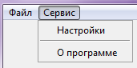

# Python

---
### Ceh 2: ###
---
### ***Инструкция по использованию программного обеспечения «Оборот документов Цех № 2»*** ###

## **Необходимое программное обеспечение:** ##
Виртуальная машинная среда Python версии 3 и выше.
Дополнительные библиотеки: tkinter, os, sqlite3, sys, datetime, hashlib, shutil, subprocess.
Большинство из требуемых библиотек содержатся в Python3.

## **Требования к системе:** ##
Операционная система, поддерживающая необходимое программное обеспечение.
Мышь, клавиатура или их аналоги для осуществления взаимодействия с программой.
100 мб оперативной памяти (в зависимости от размера БД и операционной системы, данный показатель может варьироваться).
5 мб свободного пространства (данный показатель будет увеличиваться с увеличение БД).
+ свободное пространство на жестком диске для сохранения сканов (зависит от количества и качества сканов).

## **Требования к персоналу:** ##
Начальные навыки по использованию персонального компьютера (умение пользоваться клавиатурой, мышкой, умение взаимодействовать с графическим интерфейсом).

## **Инструкция по использованию:** ##
Запуск осуществляется посредством вызова файла index.py с помощью Python версии 3 и выше.

Также запуск может осуществляться с помощью файла, в котором прописана данная команда.

После запуска приложения на экране отображается главное меню программы, в котором расположено навигационное окно. Из главного меню можно осуществить переход к документам, архиву или выйти из приложения. При нажатии на кнопку Документы, происходит переход к странице, на которой отображены все документы, не отправленные в архив.

В данном окне можно увидеть основную информацию по документам: наименование документа и дата документа. Также основная информация по последней передаче документа: когда и кому направился документ и оставшийся срок, а также поручение. В данном окне есть возможность добавить новый документ, включить фильтр по документам, сбросить фильтр, открыть окно редактирования документа, перейти в раздел справочников. При нажатии кнопки добавить документ, происходит открытие окна добавления.

При добавлении документа необходимо указать наименование документа, а также дату документа – данные поля являются обязательными к заполнению. Необязательным полем является кнопка скана. При нажатии на которую происходит открытие проводника с возможностью выбора документа. Документ можно выбрать только один, в случае присутствия других сканов, есть возможность добавить их в дальнейшем, при редактировании документа. После нажатия кнопки добавить, происходит добавления записи в БД, а также сохранение документа со сканом. Новый документ отобразится на странице со всеми документами. Документы отображаются в порядке добавления.
При активации фильтра происходит отображение  документов с данными параметрами

Сброс фильтра осуществляет сброс параметров фильтра.
Для удаления записи, необходимо выбрать необходимую запись и нажать клавишу на клавиатуре Delete. Далее подтвердить удаление и запись будет полностью удалена (без возможности восстановления!!!).

Для редактирования документа необходимо в списке по нему нажать два раза левой кнопкой мыши.

В данном окне представлена основная информация о конкретном документе: наименование и дата документа, прикрепленные сканы к документу, направления документа, а также возможность переместить документ в архив.
Если поставить галочку в поле Архив, тогда документ будет перемещён в раздел архив. Это сделано для разгрузки страницы с документами.
На данной странице присутствует возможность добавления сканов. Для этого необходимо нажать клавишу новый скан, после этого откроется проводник, в котором необходимо выбрать нужный скан. Сканы отображаются в порядке добавления. Сохранение резолюций происходит по адресу указанному в настройках путь к резолюциям (path_resolution).
Любой скан можно открыть, дважды нажав по нему левой клавишей мыши.
Для того чтобы направить документ необходимо нажать соответствующую кнопку.

В открывшемся окне необходимо внести основную информацию по направлению данного документа. Дата направления, исполнитель, дата исполнения – данные поля являются обязательными к заполнению! В поле дата исполнения указывается дата в формате: день.месяц.год (например, 17.09.2020). Остальные поля заполняются по мере необходимости.
После добавления направления оно появится в таблице направлений. Здесь происходит отображение основной информации по направлению: дата направления, кому направлено, дата исполнения, поручение и оставшийся срок исполнения.
Для удаления направления необходимо его выбрать и нажать клавишу Delete на клавиатуре.
Для редактирования направления необходимо нажать два раза левой клавишей мышки по записи. После нажатия открывается окно редактирования направления.

Для сохранения изменений в окне редактирования документа, необходимо нажать клавишу сохранить. После этого изменения отобразятся в главном окне всех документов.
Выйти из окна всех документов в главное меню можно с помощью кнопки назад.
Окно архива содержит главную информацию о документах отправленных в архив.
Верхнее меню приложения содержит два основных меню: Файл и Сервис.
В меню файла происходит процесс создания отчётов, открытие окна с последними отчётами, а также кнопка выхода из приложения.

При наведении на кнопку печать выпадать список с возможными форматами (ненастоящий Word, ненастоящий Excel, HTML формат).
При нажатии нужного формата происходит процесс создания отчёта, после которого будет выведено соответствующее окно. Документ сохраняется по адресу указанному в настройках программы в разделе путь к отчётам (path_reports).
При выборе в меню пункта последние отчёты открывается новое окно со списком последних 17 отчётов.

Отображается наименование документа, дата создания и путь к файлу.
Чтобы открыть документ необходимо дважды по нему нажать левой клавишей мыши.
В меню сервис происходит настройка приложения и информация о программе.

При выборе пункта настроек происходит открытие окна с настройками: путь к БД, путь к ресурсам, путь к сканам, путь к отчётам. Не рекомендовано изменять настройки без должных навыков!!!

Для выбора необходимых путей, необходимо нажимать кнопки «Выбрать …». Для сохранения новых настроек на длительный срок, необходимо нажать клавишу сохранить. Путь к самому файлу настроек указывается в файле settings.py (сам файл settings.txt).
При выборе пункта «О программе» происходит открытие окна со сводной информацией.

В данном окне отображается наименование, версия, права, организация – разработчик, а также описание программного обеспечения.

## **Дальнейшее развитие:** ##
На данный момент программное обеспечение находится в стадии тестирования. При обнаружении ошибок сообщать в отдел информационных технологий. 

## **Возможные ошибки:** ##
**Permission denied**
Нехватка прав доступа. При открытии какого-либо файла может возникнуть данная ошибка. Возможные пути решения: изменение прав доступа на открываемый файл, изменение прав доступа на файл, который пытается открыть. Проверка правильности указанного пути.
**File not found**
Не найден файл. Возможные пути решения проблемы: проверка правильности пути. Проверка уровня доступа. Возможно замена относительных путей на абсолютные.
**Python2**
Программа не расчитана на использование в среде Python2. Отсутствует часть функционала.
**ICON**
Ошибка при попытки отобразить иконку приложения. Искать вариант использования tkinter icon под вашу операционную систему.
**Subsystem or OS.system**
Ошибка при открытии файла из программы (скана или отчёта). Искать возможные аналоги данных функция под вашу операционную систему.
**Ошибка сертификата при установке модуля Python**
Использовать ключ для отключения проверки сертификата. Обновить сертификаты. Загрузить в корень ОС сертификат.

## **Структура приложения:** ##
Ceh_2: - корень приложения
> data.py – основной корень приложения
> DB.py – взаимодействие с БД
> direction.py – модель направлений
> document.py – модель документ
> executor.py – модель исполнитель
> frame_about_the_programm.py – окно о программе
> frame_archive.py – окно архива
> frame_document.py – окно всех документов
> frame_executor.py – окно исполнителей
> frame_filter.py – окно фильтра
> frame_menu.py – окно главного меню
> frame_new_direction.py – окно нового направления
> frame_new_document.py – окно нового документа
> frame_new_executor.py – окно нового исполнителя
> frame_reports.py – окно последних отчётов
> frame_settings.py – окно настроек
> frame_update_direction.py – окно обновления направления
> frame_update_document.py – окно обновления документа
> frame_update_document_archive.py – окно обновления документа архива
> frame_update_executor.py – окно обновления исполнения
> index.py – точка входа приложения
> resolution.py – модель для сканов
> setting.py – модуль настроек
> settings.txt – файл настроек
>
>> db – директория БД (можно изменить в настройках)
>> ceh2.db – БД
>
>> reports – директория отчётов (можно изменить в настройках)
>
>> resolutions – директория сканов (можно изменить в настройках)
>
>> insructions – директория с инструкциями
>> instruction.doc
>
>> resources – директория ресурсов (можно изменить в настройках)
>> sns.ico
>> study.gif
>> study.png
>> study.xbm
>> Treetog-Junior-Folder-documents.ico
>
>> __pycache__ - директория с кэшами

## **Файл настроек:** ##
path_db=db/ceh2.db;
path_resource=resources;
path_resolution=C:\Users\admin\Documents\Python\Ceh_2\resolutions;
path_reports=C:/Users/admin/Documents/Python/Ceh_2/reports;
Данный файл создаётся автоматически при его отсутствии. В конце каждой строчки стоит « ; ».

## **Структура базы данных:** ##

База данных состоит из 4 таблиц: таблица с документами (documents), таблица со сканами (resolutions), таблица с направлениями (directions), таблица с исполнителями (executors). Тип соединения НЕ каскадный!!!