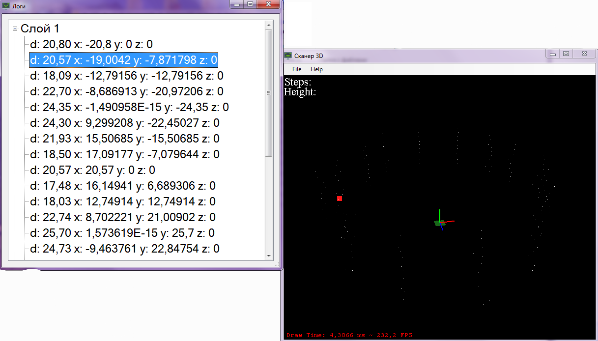
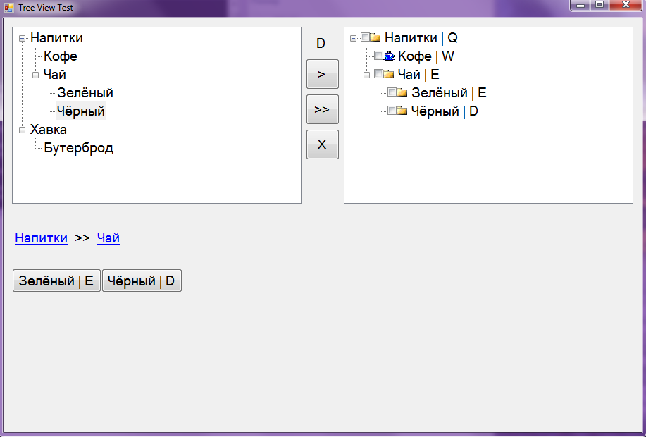

# Visual Studio (.NET)

---
### Alarm: ###

---
### Ant Search Algorithm: ###

---
### ARM: ###

---
### ARM New View Reports: ###

---
### AudioSSA ###

---
### AutoUpdater ###

---
### Ballistic Wind ###

---
### BD Test SQLite ###

---
### Calc ###

---
### CallBack Console ###

---
### Change Graphics ###

---
### Check Connection ###

---
### Color Picker ###

---
### Comprasion Image ###

---
### ConvertExcelToBD ###

---
### Exams ###

---
### FTP All ###

---
### MovingSSA ###

---
### ReportsOnGOZ ###

---
### Sapper ###

---
### Scanner ###

---
### Search Path ###

---
### Serial Port View ###

---
### Console Snake ###

---
### Thread TCP Forms ###

---
### Tree View ###

---
### Triangulation ###

---
### Video Tracking ###

