# C++ #

---
### Ceh 2: ###
---
### ***Инструкция по использованию программного обеспечения «Перемещение рабочих кадров по цеху №2»*** ###

## **Необходимое программное обеспечение:** ##
Операционная система семейства Linux (например, Ubuntu).
Компилятор GCC.
Библиотека QT5 basic.
Дополнительные библиотеки: QString, QDialog, QObject, QSql, QSqlQuery, QSqlError, QSqlDatabase, QSqlTableModel, QFile, QDate, QDebug, QList, QDir, QStandardItemModel, QTextCodec, QDesktopServices, QUrl, QFileDialog, QTextStream, types, stat.
Большинство из требуемых библиотек содержатся в QT5 basic.

## **Установка необходимого программного обеспечения:** ##
Скачать ОС с оффицального сайта. Установить, следуя указаниям установщика.

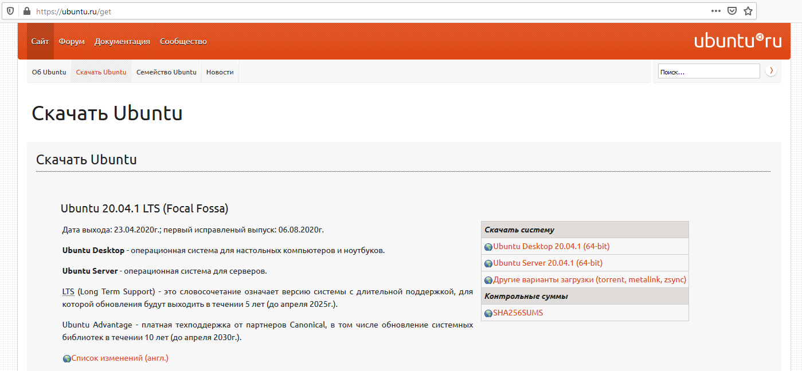

Для установки набора компиляторов GCC, необходимо запустить терминал и выполнить ряд команд. Пример установки в Ubuntu представлен дальше:

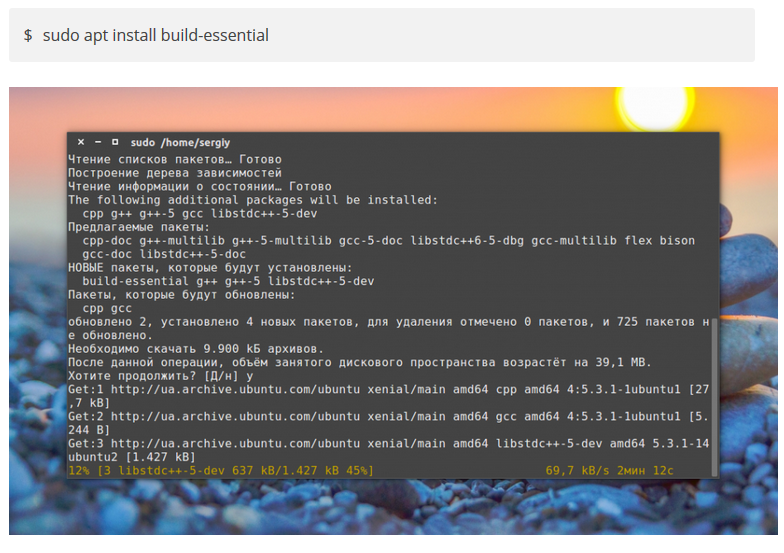

Далее можно просмотреть версии и расположение компиляторов:

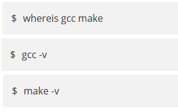

Далее необходимо установить библиотеку qt5. Нас устроит текущая версия QT5, которая есть в оффицальных репозиториях дистрибутива.

Следующим шагом необходимо переместить проект с программой в рабочий каталог.
Установить права исполнения на файл MovingWorkersCeh2.

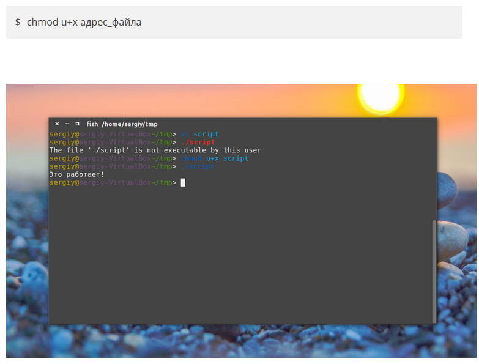

В большинстве случаев этого достаточно, но если Вы хотите, чтобы файл могли выполнять и другие пользователи, то необходимо указать также другие категории:

Далее происходит запуск и работа с программным обеспечением (смотрите инструкцию по использованию).

## **Требования к системе:** ##
Операционная система, поддерживающая необходимое программное обеспечение.
Мышь, клавиатура или их аналоги для осуществления взаимодействия с программой.
200 мб оперативной памяти (в зависимости от размера БД и операционной системы, данный показатель может варьироваться).
15 мб свободного пространства под БД (данный показатель будет увеличиваться с увеличение БД).

## **Требования к персоналу:** ##
Начальные навыки по использованию персонального компьютера (умение пользоваться клавиатурой, мышкой, умение взаимодействовать с графическим интерфейсом).

## **Инструкция по использованию:** ##
Запуск осуществляется посредством вызова файла MovingWorkersCeh2.

Также запуск может осуществляться с помощью файла, в котором прописана данная команда или двойным нажатием по ярлыку программы, если проведены соответствующие настройки операционной системы.

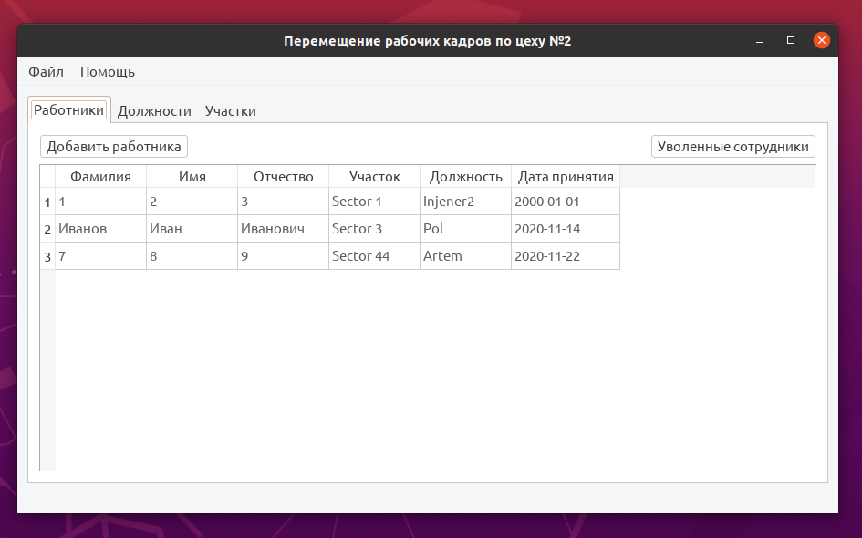

После запуска приложения открывается главное меню – окно со списком сотрудников. В данном окне можно просмотреть список сотрудников на данный момент работающих в цехе, а также добавить, редактировать сотрудника и просмотреть уволенных сотрудников.
В таблице отображается сводная информация о сотрудниках: ФИО, участок, должность и дата принятия.

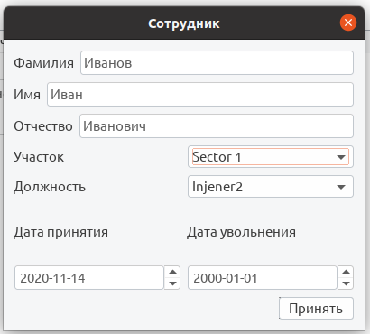

В окне добавления/редактирования сотрудника указываются фамилия, имя, отчество, участок работы, должность, дата принятия, дата увольнения. Даты указываются в формате год-месяц-день (например, 2020-11-24). Для увольнения сотрудника необходимо поставить отметку в поле уволить и выставить дату увольнения. В случае если сотрудник не уволен, устанавливается дата 2000-01-01.
Также в данном окне присутствует возможность удаления сотрудника. В случае нажатия на данную кнопку и подтверждение действий сотрудник будет удалён из базы данных без возможности восстановления!
При нажатии кнопки уволенные сотрудники открывается соответствующее окно.

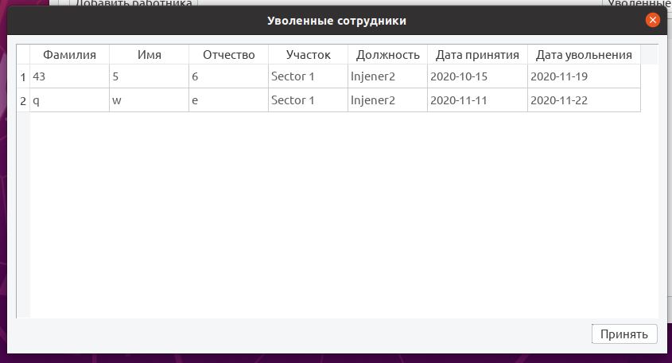

Уволенного сотрудника можно восстановить, убрав отметку об увольнении, автоматически будет указана дата увольнения 2000-01-01.
Переход между таблицами осуществляется посредствам использования закладок.
Выбрав закладку должности, открывается таблица со сводной информацией по должностям.

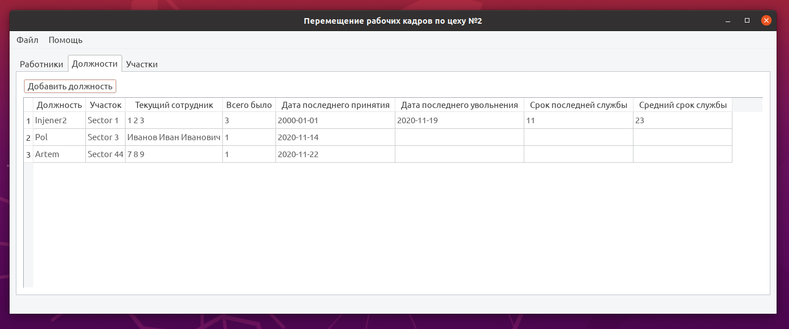

В данной таблице представлена информация о наименовании должности, участок к которому данная должность относится, сотрудник, занимающий данную должность на данный момент, сколько всего было сотрудников на данной должности, дата последнего принятия сотрудника на должность, дата последнего увольнения с должности, срок последней работы по должности и средний срок продолжительности работы на данной должности.

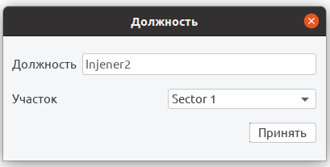

В окне добавления/редактирования должности происходит выбор участка, к которому должность будет относиться, и написать её наименование. Также в данном окне присутствует возможность удаления должности. В случае нажатия на данную кнопку и подтверждения действия происходит удаление должности из базы данных, а также удаление всех сотрудников, занимаемых данную должность без возможности восстановления!

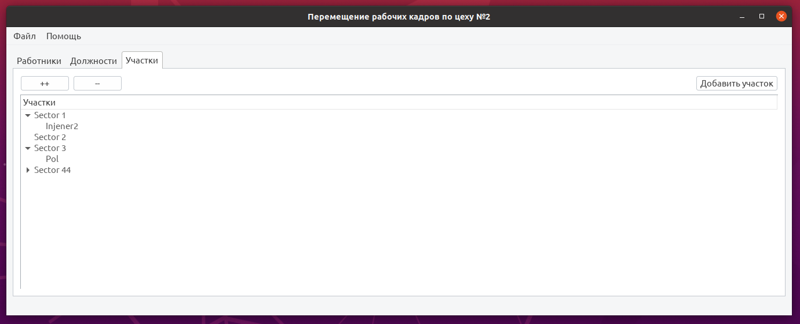

В данном окне представлено древо содержащее список участков с возможностью просмотреть список должностей по данному участку.
Кнопки «++» и «--» позволяют быстро развернуть все участки и свернуть обратно.

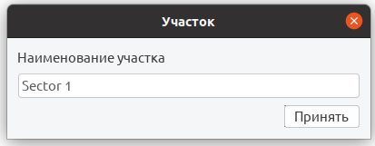

В данном окне происходит ввод наименования участка. Также в данном окне присутствует возможность удаления участка. В случае нажатия на данную кнопку и подтверждения действия происходит удаления участка из базы данных, а также удаление всех должностей на данном участке и сотрудников занимающих эти должности без возможности восстановления!
В верхней части окна программы находится меню с двумя выпадающими списками файл и помощь.

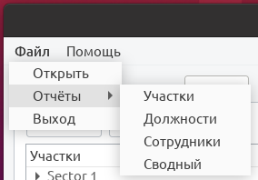

В меню файл находятся следующие команды:
> Открыть – открывает дирректорию с программой.
> Отчёты – выпадающее меню с возможностью создания 4 отчётов (отчёт по участку (предоставляет список участков с наименованием должностей), отчёт по должности (происходит выбор конкретной должности и создаётся документ с сотрудниками, занимающими данную должность когда-либо), отчёт по сотрудникам (происходит создание документа со всем сотрудниками, работающими в цехе), отчёт сводный (происходит создание документа со всеми сотрудник, включая уволенных)).
> Выход – кнопка для закрытия приложения.

В меню помощь находятся две команды: настройка и о программе.

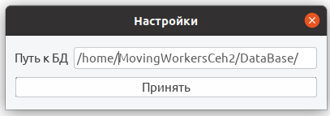

При нажатии кнопки настройка происходит открытие окна с указанием пути к БД (после изменения данной настройки, программу необходимо перезапустить).

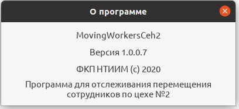

При выборе пункта о программе происходит открытие окна с соответствующей информацией.

## **Дальнейшее развитие:** ##
На данный момент программное обеспечение находится в стадии тестирования. При обнаружении ошибок сообщать в отдел информационных технологий. 

## **Возможные ошибки:** ##
**Permission denied**
Нехватка прав доступа. При открытии какого-либо файла может возникнуть данная ошибка. Возможные пути решения: изменение прав доступа на открываемый файл, изменение прав доступа на файл, который пытается открыть. Проверка правильности указанного пути.
**File is not executable by this user**
Нехватка прав для исполнения приложения. Для исправления данной ошибки обратитесь в раздел «установка необходимого программного обеспечения».
**File not found**
Не найден файл. Возможные пути решения проблемы: проверка правильности пути. Проверка уровня доступа. Возможно замена относительных путей на абсолютные.
**Отсутствие QT.**
При запуске приложения может оказаться, что на Вашем компьютере не установлена QT, либо установленна не правильная версия. Узнать необходимую версию библиотеки можно в тексте ошибки. Для установки QT обратитесь к разделу «установка необходимого программного обеспечения».
**Отсутствие GCC.**
Если на Вашем компьютере отсутствует GCC компилятор, то необходимо его установить согласно разделу «установка необходимого программного обеспечения».

## **Структура приложения:** ##
MovingWorkersCeh2: - корень приложения
> Application – директория с приложением
>> abouttheprogram.o – файл объекта окна «о программе»
>> database.o – файл объекта класса для работы с базой данных
>> main.o
>> mainwindow.o
>> Makefile – сборочный файл
>> moc_abouttheprogram.cpp – методанные об окне «о программе»
>> moc_abouttheprogram.o
>> moc_database.cpp
>> moc_database.o
>> moc_mainwindow.cpp
>> moc_mainwindow.o
>> moc_positionswindow.cpp
>> moc_positionswindow.o
>> moc_reportpositionswindow.cpp
>> moc_reportpositionswindow.o
>> moc_sectorswindow.cpp
>> moc_sectorswindow.o
>> moc_settingswindow.cpp
>> moc_settingswindow.o
>> moc_usersdismisswindow.cpp
>> moc_usersdismisswindow.o
>> moc_userswindow.cpp
>> moc_userswindow.o
>> MovingWorkersCeh2 – точка входа в приложение
>> position.o
>> positionswindow.o
>> reportpositionswindow.o
>> sector.o
>> sectorswindow.o
>> settingswindow.o
>> ui_abouttheprogram.h – заголовочный файл для UI окна «о программе»
>> ui_mainwindow.h
>> ui_positionswindow.h
>> ui_reportpositionswindow.h
>> ui_sectorswindow.h
>> ui_settingswindow.h
>> ui_usersdismisswindow.h
>> ui_userswindow.h
>> user.o
>> usersdismisswindow.o
>> userswindow.o
>>
>>> DataBase – директория БД (можно изменить в настройках)
>>> SecondCehDataBase.db – БД
>>
>>> Settings – директория с настройками
>>> settings.txt
>>
>>> Reports – директория отчётов
>
>> Insructions – директория с инструкциями
>> Инструкция по использованию программного обеспечения.doc
>> Код приложения.doc
>
>> MovingWorkersCeh2_OriginalCode – директория с исходным кодом программы
>> abouttheprogram.cpp – код окна «о программе»
>> abouttheprogram.h – заголовочный файл окна «о программе»
>> abouttheprogram.ui – XML структура UI окна «о программе»
>> database.cpp – код класса для работы с базой данных
>> database.h – заголовочный файл класса для работы с базой данных
>> main.cpp – точка входа в приложение
>> mainwindow.cpp – код главного окна приложения
>> mainwindow.h – заголовочный файл главного окна приложения
>> mainwindow.ui – XML структура UI главного окна приложения
>> MovingWorkersCeh2.pro – файл QT project
>> MovingWorkersCeh2.pro.user – файл настроек для QT
>> position.cpp – код класса для работы с должностями
>> position.h – заголовочный файл класса для работы с должностями
>> positionswindow.cpp – код окна для добавления/редактирования должностей
>> positionswindow.h – заголовочный файл окна для добавления/редактирования должностей
>> positionswindow.ui – XML структура UI окна добавления/редактирования должностей 
>> reportpositionswindow.cpp – код программы окна для подготовки отчёта по должности
>> reportpositionswindow.h – заголовочный файл окна для подготовки отчёта по должности
>> reportpositionswindow.ui – XML структура UI окна для подготовки отчёта по должности
>> sector.cpp – код класса для работы с участками
>> sector.h – заголовочный файл для работы с участками
>> sectorswindow.cpp – код окна для добавления/редактирования участка
>> sectorswindow.h – заголовочный файл окна для добавления/редактирования участка
>> sectorswindow.ui – XML структура UI окна для добавления/редактирования участка
>> settingswindow.cpp – код окна для изменения настроек
>> settingswindow.h – заголовочный файл окна для изменения настроек
>> settingswindow.ui – XML структура UI окна для изменения настроек
>> user.cpp – код класса для работы с сотрудниками
>> user.h – заголовочный файл для работы с сотрудниками
>> usersdismisswindow.cpp – код программы окна для отображения уволенных сотрудников
>> usersdismisswindow.h – заголовочный файл окна для отображения уволенных сотрудников
>> usersdismisswindow.ui – XML структура UI окна для отображения уволенных сотрудников
>> userswindow.cpp – код программы окна для добавления/редактирования сотрудников
>> userswindow.h – заголовочный файл окна для добавления/редактирования сотрудников
>> userswindow.ui – XML структура UI окна для добавления/редактирования сотрудников

## **Файл настроек:** ##
home/ MovingWorkersCeh2/DataBase/ SecondCehDataBase.db;
Данный файл создаётся автоматически при его отсутствии. В конце каждой строчки стоит « ; ».

## **Структура базы данных:** ##
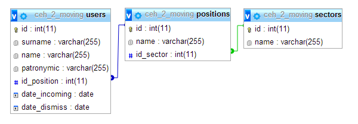
База данных состоит из 3 таблиц: таблица с участками (sectors), таблица с должностями (positions), таблица с сотрудниками (users). Тип соединения НЕ каскадный!!!